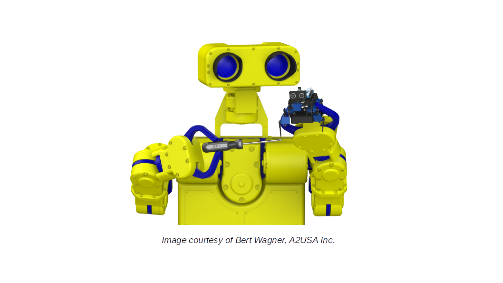
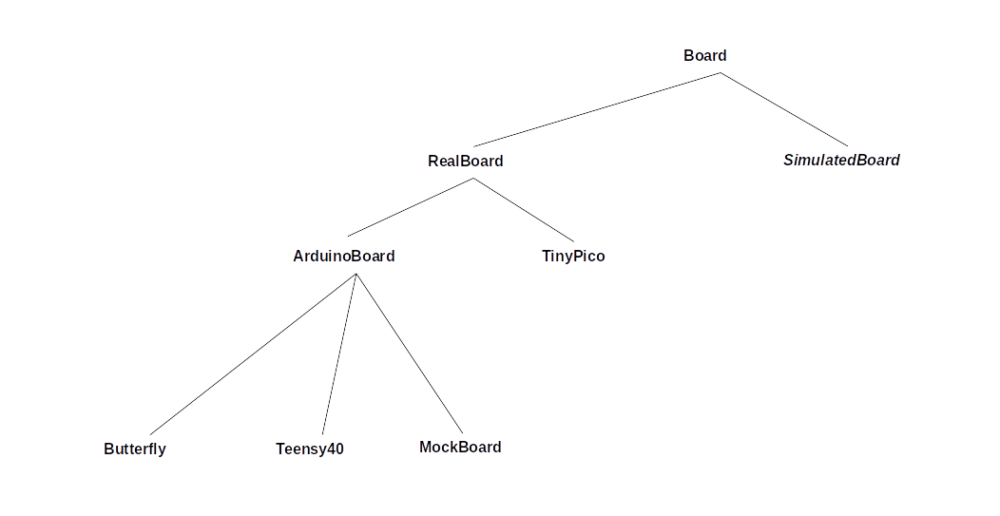
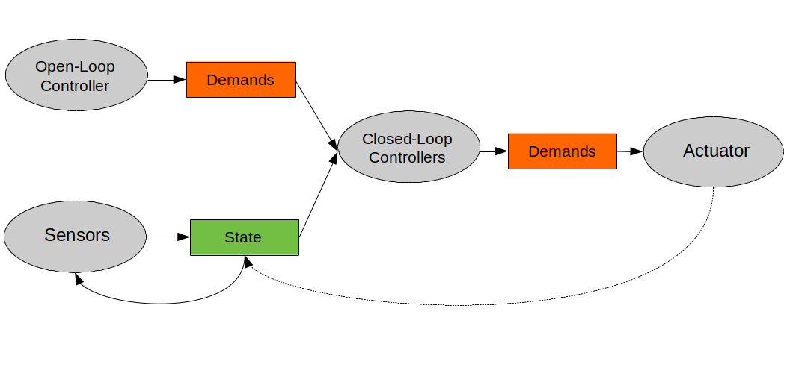

<!-- img src="extras/media/bobbie-rft.png" width=400 align=right -->

## Intro

**RoboFirmwareToolkit** (RFT) is a simple, platform-independent, header-only C++ toolkit
for building robot firmware to run on Arduino and other microcontrollers.  Because
of its platform-independence it can also be used as the control code in a
C++-based robot [simulator](https://github.com/simondlevy/MulticopterSim).  As with 
other software [platforms](https://github.com/simondlevy) I've developed, the
focus is on simplicity and ease-of-use rather than lots of features.

RFT is geared toward people like me who want to tinker with firmware and use
it to teach students about topics like
[open-loop / closed loop control](https://circuitglobe.com/difference-between-open-loop-and-closed-loop-system.html),
[sensor fusion](https://en.wikipedia.org/wiki/Sensor_fusion),
and related important ideas in robotics.  People will typically learn about such important ideas from a textbook,
and then implement them in a &ldquo;bottom-up&rdquo; (ad-hoc) way on Arduino, Teensy, STM32, ESP32, and
other microcontrollers. This approach is useful for rapid prototyping but makes it
difficult to extend the project beyond the prototyping stage.  RFT aims to fill
this gap by taking a top-down approach in which controllers, sensors, and actuators can be
plugged into a pre-existing framework in a way that is easily extended for more advanced work.
(If you're familiar with [ROS](https://www.ros.org/), this approach will already make sense, but
whereas ROS is a massive package providing an entire operating system
supporting multiple robots and programming languages, RFT is focused entirely
on simple C++ firmware for a single robot.)

## C++ Classes

RFT grew out my experience developing a simple [toolkit](https://github.com/simondlevy/Hackflight)
for flight-control firmware of multi-rotor vehicles.  At some point I realized that most of this
code would work just as well with other kinds of robotic vehicles.  The object-oriented approach 
of C++ made it straightforward to support other robot types through abstract classes:

* The <a href="https://github.com/simondlevy/RoboFirmwareToolkit/blob/master/src/RFT_board.hpp">Board</a>
class specifies an abstract (pure virtual) <tt>getTime()</tt> method that you must
implement for a particular microcontroller or simulator.  As the following class hiearchy shows, 
several boards are currently supported:

 

* The <a href="https://github.com/simondlevy/RoboFirmwareToolkit/blob/master/src/RFT_openloop.hpp">OpenLoopController</a>
class performs basic functions associated with open-loop control, and specifies a set of abstract methods that you
implement for a particular controller like an R/C receiver.

* The <a href="https://github.com/simondlevy/RoboFirmwareToolkit/blob/master/src/RFT_actuator.hpp">Actuator</a>
class is an abstract class that can be subclassed for various kinds of actuators; for example, a multirotor
mixer controlling a number of motors.  In principle, you need only one Actuator object for each project,
since it can be subclassed to control any number of motors, arms, grippers, etc.

With these three classes (Board, OpenLoopController, Actuator) you can implement a traditional vehicle like
an R/C car, that involves no closed-loop control.  For most projects, of course, you'll want to add closed-loop
control via sensors.  Hence RFT also provides the following abstract classes:

* The <a href="https://github.com/simondlevy/RoboFirmwareToolkit/blob/master/src/RFT_closedloop.hpp">ClosedLoopController</a>
class specifies an abstract method <tt>modifyDemands()</tt> that inputs the robot's current state and
outputs an array of floating-point values representing how that controller affects the demands. (For example,
an altitude-hold controller for a quadcopter would use the 'copter's altitude
and vertical velocity to adjust the throttle demand.)  If you're
mathematically-minded, you can think of a closed-loop controller as a function from a
(<i>State</i>, <i>Demands</i>) pair to <i>Demands</i>:
<b><i>ClosedLoopController</i>: <i>State</i> &times; <i>Demands</i> &rarr; <i>Demands</i></b>

* The <a href="https://github.com/simondlevy/RoboFirmwareToolkit/blob/master/src/RFT_sensor.hpp">Sensor</a>
class specifies abstract methods <tt>ready()</tt> for checking whether the sensor
has new data avaiable, and  <tt>modifyState()</tt> for modifying the vehicle's
state based on that data.  If you're mathematically-minded, you can think of a
sensor as a function from states to states: <b><i>Sensor</i>: <i>State</i> &rarr;
<i>State</i></b>

Together, these classes interact as shown in the following diagram:

 

## PID controllers

Because [PID control](https://en.wikipedia.org/wiki/PID_controller) is the most
popular kind of closed-loop control, RFT sub-classes ClosedLoopController with a 
[PidController](https://github.com/simondlevy/RoboFirmwareToolkit/blob/main/src/rft_closedloops/pidcontroller.hpp)
class.

## Other useful classes

* A <a href="https://github.com/simondlevy/RoboFirmwareToolkit/blob/master/src/RFT_timertask.hpp">TimerTask</a>
class that allows you to run different processes (closed-loop control, serial communication) at different rates.

* A <a href="https://github.com/simondlevy/RoboFirmwareToolkit/blob/master/src/RFT_motor.hpp">Motor</a> class that
allows you to specify the hardware pin(s) for your motor(s), with individual motor types (brushed, brushless) supported
through sub-classes. To spin a motor, you specify the index (id) of the motor you want, along with a speed normalized between
0 (off) and 1 (maximum possible speed), allowing you to avoid worrying about the low-level signal details.

* A <a href="https://github.com/simondlevy/RoboFirmwareToolkit/blob/master/src/RFT_debugger.hpp">Debugger</a> class
providing a C-like <tt>printf</tt> method that works with the Board class to direct debugging output to the Arduino Serial Monitor
(for Arduino-compatible boards) or an on-screen display (for simulators).

* A <a href="https://github.com/simondlevy/RoboFirmwareToolkit/blob/master/src/RFT_filters.hpp">Filters</a> class
providing static methods for simple filters
([complementary](https://www.quora.com/What-is-a-complimentary-filter-How-does-it-differ-from-a-Kalman-filter)),
a class for [Low-Pass-Filters](https://en.wikipedia.org/wiki/Low-pass_filter), and two classes for the Quaternion-filtering
algorithms [Madgwick](https://courses.cs.washington.edu/courses/cse474/17wi/labs/l4/madgwick_internal_report.pdf)
and [Mahony](https://nitinjsanket.github.io/tutorials/attitudeest/mahony#mahonyfilt).  (Because I have not had much need for
Kalman filtering in my robotics work, I did not include a Kalman filter class here; but I do have an implementation of this
filter in another [repository](https://github.com/simondlevy/TinyEKF)).

## Serial communication

For serial communication, RFT relies on the lightweight [Multiwii Serial Protocol](http://www.armazila.com/MultiwiiSerialProtocol(draft)v02.pdf) (MSP).  The [SerialTask](https://github.com/simondlevy/RoboFirmwareToolkit/blob/main/src/RFT_serialtask.hpp) class contains code for parsing
arbitrary MSP messages.  By writing a subclass implementing the <tt>dispatchMessage()</tt>  method of this class, you can support the 
messages you want for your robot.  To help facilitate creating such messages, RFT provides a
[parser generator](https://github.com/simondlevy/RoboFirmwareToolkit/tree/main/extras/parser) program
that emits MSP-handling code in C++, Java, and Python based on simple JSON message specifications.
